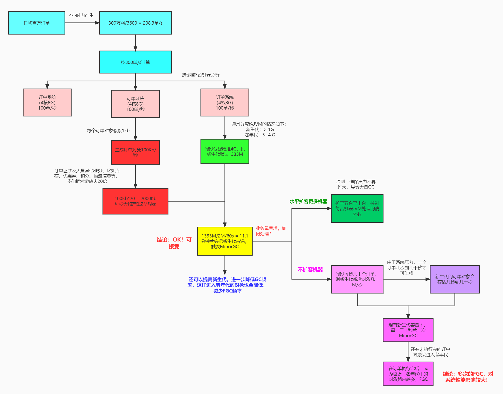

# 尚硅谷JVM精讲与GC调优[教程](https://www.bilibili.com/video/BV1Dz4y1A7FB/)（宋红康主讲，含jvm面试真题）相关

## 课件
- [第1篇-字节码篇](./尚硅谷_JVM精讲与GC调优第1篇-字节码篇.mmap) [txt](./尚硅谷_JVM精讲与GC调优第1篇-字节码篇.mmap.txt)
- [第2篇-类的加载篇](./尚硅谷_JVM精讲与GC调优第2篇-类的加载篇.mmap) [txt](./尚硅谷_JVM精讲与GC调优第2篇-类的加载篇.mmap.txt)
- [第3篇-运行时内存篇](./尚硅谷_JVM精讲与GC调优第3篇-运行时内存篇.mmap) [txt](./尚硅谷_JVM精讲与GC调优第3篇-运行时内存篇.mmap.txt)
- [第4篇-对象内存布局](./尚硅谷_JVM精讲与GC调优第4篇-对象内存布局.mmap) [txt](./尚硅谷_JVM精讲与GC调优第4篇-对象内存布局.mmap.txt)
- [第5篇：执行引擎篇](./尚硅谷_JVM精讲与GC调优第5篇：执行引擎篇.mmap) [txt](./尚硅谷_JVM精讲与GC调优第5篇：执行引擎篇.mmap.txt)
- [第6篇-垃圾回收篇](./尚硅谷_JVM精讲与GC调优第6篇-垃圾回收篇.mmap) [txt](./尚硅谷_JVM精讲与GC调优第6篇-垃圾回收篇.mmap.txt)
- [第7篇-JVM性能监控篇](./尚硅谷_JVM精讲与GC调优第7篇-JVM性能监控篇.mmap) [txt](./尚硅谷_JVM精讲与GC调优第7篇-JVM性能监控篇.mmap.txt)
- [第8篇-JVM性能调优案例篇](./尚硅谷_JVM精讲与GC调优第8篇-JVM性能调优案例篇.mmap) [txt](./尚硅谷_JVM精讲与GC调优第8篇-JVM性能调优案例篇.mmap.txt)

## 代码
- [chapter01_bytecode](./JVMdachang/chapter01_bytecode/)
- [chapter02_classload](./JVMdachang/chapter02_classload/)
- [chapter03_runtimearea](./JVMdachang/chapter03_runtimearea/)
- [chapter04_object](./JVMdachang/chapter04_object/)
- [chapter05_executionengine](./JVMdachang/chapter05_executionengine/)
- [chapter06_gc](./JVMdachang/chapter06_gc/)
- [chapter07_monitoring](./JVMdachang/chapter07_monitoring/)
- [chapter008_tuning](./JVMdachang/chapter008_tuning/)
- [chatper08_tuning](./JVMdachang/chatper08_tuning/)

## 其他
- [案例7：日均百万订单系统JVM参数设置.jpg](./案例7：日均百万订单系统JVM参数设置.jpg) 

- [常量类型和结构.xls](./常量类型和结构.xls)
- [Demo字节码的解析.xlsx](./Demo字节码的解析.xlsx)
- [Java的深拷贝与浅拷贝.docx](./Java的深拷贝与浅拷贝.docx)
- [JMeter压测工具的使用.mmap](./JMeter压测工具的使用.mmap)
- [JVM大厂面试真题.md](./JVM大厂面试真题.md)

## 软件下载
- [JProfiler v11.0.2](https://pan.baidu.com/s/1Z-qjgjLxVi262WvYPlGB4Q) 提取码：iohg
- [其他](https://txyz.lanzoue.com/b03qthcwf) 密码:88ka

## 其他
- [b站教程链接](https://www.bilibili.com/video/BV1Dz4y1A7FB/)
- [尚硅谷宋红康JVM全套教程（详解java虚拟机）相关](https://github.com/xftxyz2001/atguigu-jvm)
